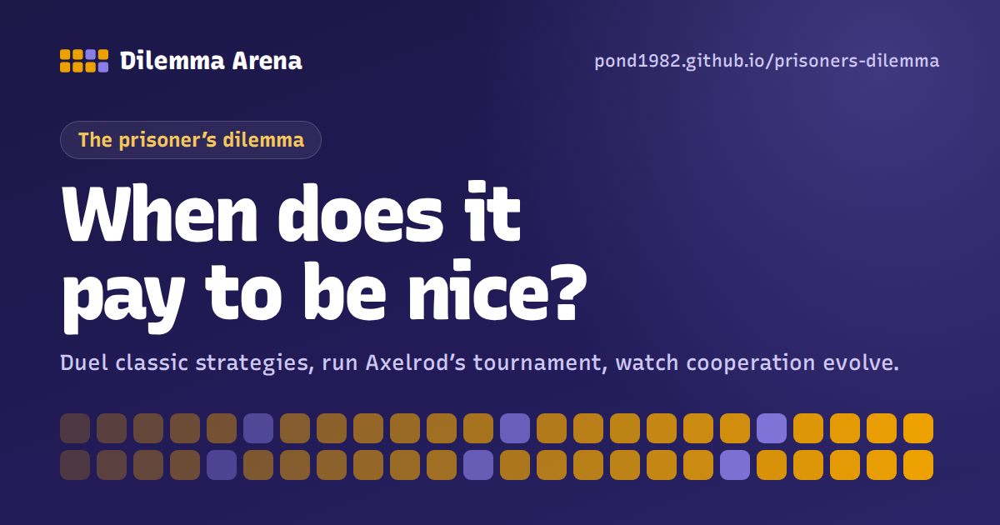

# ร่วมมือหรือหักหลัง · Prisoner's Dilemma Arena

**Play it:** [ภาษาไทย](https://pond1982.github.io/prisoners-dilemma/) · [English](https://pond1982.github.io/prisoners-dilemma/en/)

An interactive, bilingual (Thai and English) explainer and simulator of the **prisoner's dilemma** (ความลำบากใจของนักโทษ) and **Axelrod's tournament**. You can play the game yourself and watch 14 classic strategies, such as **Tit for Tat**, face off. You can run round-robin tournaments and evolutionary simulations, and build your own strategy. It all runs in the browser, free and with no sign-up.

Created by [Suwitcha “Pondd” Sugthana](https://pond1982.github.io/Pondd-Page/).

## What's in this folder

| File | What it is |
| --- | --- |
| `index.html` | The Thai site (home page) |
| `en/index.html` | The English site |
| `sitemap.xml` | Both pages and their language alternates, for search engines |
| `og-th.png`, `og-en.png` | Link-preview images for LINE, Facebook, X, LinkedIn and chat apps |
| `favicon.svg`, `apple-touch-icon.png` | Browser-tab and home-screen icons |
| `.nojekyll` | Tells GitHub Pages to serve the files as they are |

It's a static site with no build step and no dependencies. Only the fonts come from Google Fonts.

## Search and sharing setup (already in the pages)

- Titles and descriptions in Thai and English built around what people search for, such as "prisoner's dilemma คือ", ความลำบากใจของนักโทษ, ทฤษฎีเกม, Axelrod tournament and Tit for Tat.
- A canonical URL and `hreflang` links on each page, so Google shows the Thai page to Thai searchers and the English page to everyone else.
- Open Graph and X card tags with 1200×630 preview images, one per language.
- Structured data (schema.org JSON-LD): `WebSite`, `WebApplication` + `LearningResource`, `Person` (creator) and `FAQPage`.
- A visible FAQ at the end of the first tab of each page, answering common questions. Its text matches the `FAQPage` data.
- `sitemap.xml`

## Help people find it (one-time steps)

1. **Google Search Console** (<https://search.google.com/search-console>)
   1. Choose **Add property → URL prefix** and enter `https://pond1982.github.io/prisoners-dilemma/`.
   2. Pick the **HTML file** method. Download the `google….html` file, upload it to the root of this repo, and click **Verify**.
   3. Open **Sitemaps**, enter `sitemap.xml` and submit.
   4. In **URL Inspection**, click **Request indexing** for both pages.
2. **Bing Webmaster Tools** (<https://www.bing.com/webmasters>): sign in and choose **Import from Google Search Console**. Bing's index also supplies other search engines and AI assistants.
3. **Link to it from pages you already have**: your Pondd-Page portfolio, LinkedIn and Facebook. Search engines find a new site fastest through links on pages they already crawl.
4. **Share it where the topic comes up**: Thai Facebook groups on economics or teaching, Pantip, LINE, r/GameTheory on Reddit, or a "Show HN" post on Hacker News. Each share shows the preview image.

## Updating

Replace the files and commit. GitHub Pages redeploys in a minute or two.

The site's address is written into `index.html`, `en/index.html` and `sitemap.xml` (canonical, `hreflang`, `og:url` and preview-image links). If the address ever changes, update it in all three.

## Notes

- Strategies people build are saved in their own browser (localStorage). Nothing is sent to a server.
- Share codes (`PDA1.…`) work in both the Thai and English versions.
- You can link to a specific tab, for example `…/prisoners-dilemma/#tournament` or `…/prisoners-dilemma/en/#evolution`.
